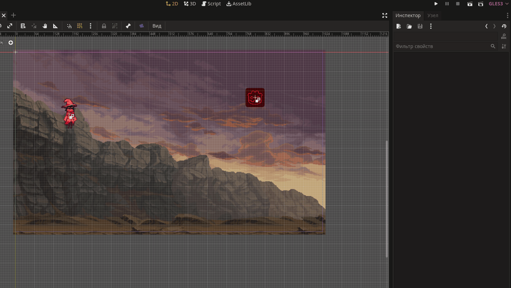
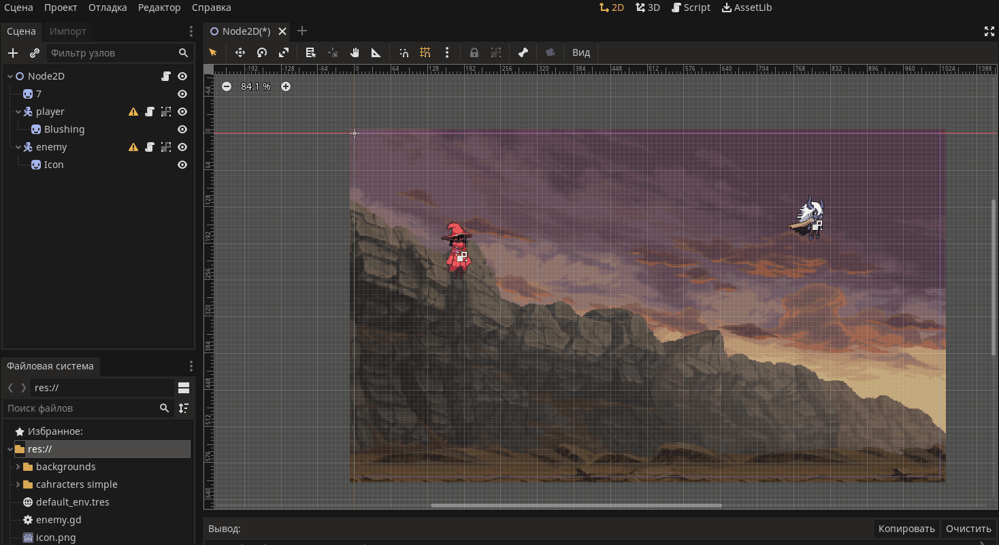
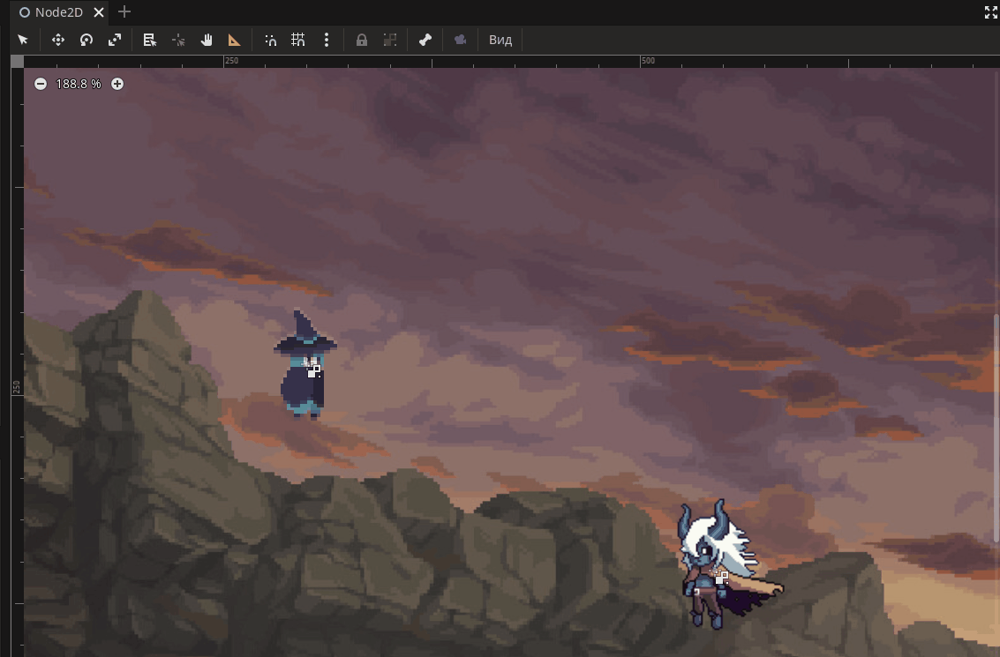

# Вводный модуль 2 урок

Цель: ещё ближе познакомить учеников с интерфейсом движка, закрепить переменные и условные конструкции. Заинтересовать в обучении дальше.

## [материалы](https://disk.yandex.ru/d/bBVIm_ZagXniUg) | [пример проекта](https://disk.yandex.ru/d/wwfRIib0H8vYBg)

## Содержание

- [Приветствие и проверка проектов](#приветствие-и-проверка-проектов-5-10-минут)
  - [Приветствие | знакомство](#приветствие--знакомство)
  - [Проверка проектов](#проверка-проектов)
  - [Если ребёнок опоздал:](#если-ребёнок-опоздал)
    - [Если видите ребёнка впервые](#если-видите-ребёнка-впервые)
    - [Если уже вели у опоздавшего ребёнка](если-уже-вели-у-опоздавшего-ребёнка)
- [Вспомнить всё](#вспомнить-всё)
- [Код](#код)
  - [Противник](#противник)
  - [Конец игры](#конец-игры)
- [Подведение итогов](#подведение-итогов)
- [Допы](#допы)

## <u>Приветствие и проверка проектов 5-10 минут</u>

### <u>Приветствие | знакомство</u>

Начинать каждый урок следует с приветствия. Обязательно поздоровайтесь с ребятами адресно и дождитесь их ответа.
После того как ученик-(ца) с вами поздоровается. Задайте ему-(ей) простой вопрос, к примеру:

1. "Как у тебя прошла неделя?"
2. "Как у тебя дела?"
3. "Что интересного ты узнал-(ла) или сделал(-ла)?"

Это поможет вам выстроить контакт с учениками и никто не будет чувствовать себя обделённым или лишним.

> [!IMPORTANT]
> Если вы видите на уроке новые лица, обязательно представьтесь новым учениками и познакомьте их с ребятами из группы.

### <u>Проверка проектов</u>

Обязательно проверьте проекты ваших учеников-(ц). Если проект потерялся или нехватает значительной части (к примеру есть только картинки, но кода нет), то алгоритм смотрите ниже: 

1. Если вы видели, что ребёнок писал код на прошлом уроке. Вы можете дать ему задание самостоятельно создать узлы с персонажем и добавить картинку на фон . А код для движения скинуть и помочь, в случае трудностей правильно его вставить. __Обязательно проверьте совпадают ли имена узлов в коде, с именами, которые ребёнок дал узлам на сцене.__

>[!IMPORTANT]
>Не скидывайте детям готовые проекты! Если дать ребёнку только код (который зачастую у всех одинаковый и так), но при этом он персонажа и узлы создаст сам, тогда у ребёнка всё равно останется чувство, что это его проект, а не чей-то.

2. Если вы видите, что других вариантов нет, вы можете перевести ребёнка в "выручай комнату" и попросить админа перезаписать ученика-(цу), предварительно объяснив причину вашего решения администратору.

>[!CAUTION]
>Данный вариант - крайний случай. Высока вероятность, что ребёнок не вернётся к нам в школу вновь. Используйте только если другого выхода действительно нет.

Проверять проекты необходимо на демонстрациях учеников-(ц). Недостаточно будет спросить "У тебя всё есть?" или "Всё ли у тебя в порядке?".

### <u>Если ребёнок опоздал</u>:

Если ребёнок опоздал на урок, обязательно поприветствовать. Задать минимум один вопрос. Ученика необходимо влить в группу!

#### <u>Если видите ребёнка впервые</u>:

1. Сколько тебе лет?
2. Где ты живёшь?
3. Опыт программирования?

#### <u>Если уже вели у опоздавшего ребёнка</u>:

1. "Как у тебя прошла неделя?"
2. "Как у тебя дела?"
3. "Что интересного ты узнал(ла) или сделал(ла)?"

> [!IMPORTANT]
> Обязательно проверьте у опоздавшего наличие проекта. Если проект потерялся или нехватает значительной части (к примеру есть только картинки, но кода нет), то смотрите алгоритм действий в разделе [проверка проектов](#проверка-проектов).

> [!TIP]
> Пока вы проверяете есть ли у опоздавшего проект и всё ли хорошо. Дайте группе задания (самостоятельно запустить движок, попробовать запустить игру и протестировать всё ли работает и т.д.)

Если ребёнок опоздал значительно, 10-15 минут (ученики-(цы) уже выставили на сцену противника, настроили позицию и готовы писать код), всё равно попробуйте включить его/её в урок. Как вариант предложите детям помочь товарищу, пусть дети почувствуют себя в роли преподавателей.

В крайнем случае, вы можете попросить администратора перезаписать ребёнка. Но всегда помните о том, что это многократно увеличит вероятность того, что ребёнок на следующий урок уже не придёт.   

>[!WARNING]
>Следите за атмосферой. Мягко контролируйте процесс, если даёте ученикам возможность объяснить товарищу, что нужно сделать. Не допускайте оскорблений и агрессии в любом виде! Подробнее о том как этого добиться, вы можете почитать на платформе, в разделе ["Модуль 6. Педагогические кейсы"](https://school.itcompot.ru/student/180337/lessons "Педагогические кейсы").

## <u>Вспомнить всё</u>

После того как вы немного поболтали, всё у всех настроили\проверили и атмосфера стала комфортнее - можно переходить к программированию.

Первым делом предложите детям самостоятельно вспомнить, как запустить их игру и как играть.
Тут есть 2 варианта: 

1. Клавиша `F5` (будьте внимательны, на некоторых ноутбуках может потребоваться дополнительно зажать клавишу `fn`)
2. Найти справа сверху кнопку запуска проекта. 

Дальше спросите чего в игре не хватает. Среди кучи вариантов, обязательно кто-нибудь скажет "противника" или "препятствия". Если чудо не произошло, постарайтесь навести их на эту мысль. 

Предложите детям самостоятельно добавить узлы для противника. Это тот же самый `KinematicBody2D` и `Sprite`, которые дети использовали для создания главного героя. Если кто-то найдёт первым-(ой). Предложите ему\ей, подсказать остальным куда нажать.

Новые узлы можно добавить нажав на `+` в разделе `фильтры узлов`.


> [!TIP]
> Пускай дети так же сами придумаю имя противнику. Напомните им как переименовать узел. Но следите за цензурой. Помните, что даже субъективно-мягкие оскорбления так же недопустимы.

В конце останется только прикрепить скрипт. Чтобы это сделать необходимо выбрать узел и найти справа сверху кнопку `прикрепить скрипт`. Это так же можно сделать нажав правой кнопкой мыши по нужному узлу и найдя в выпадающем меню `прикрепить скрипт`.

Как прикрепить скрипт:


## <u>Код</u>

### Противник

После того как ваши ученики-(цы) прикрепят скрипт. Спросите их, как будет двигаться противник? Вероятнее всего вы получите что-то вроде "будет лететь в нашу сторону".

Отлично, тут можно развить тему. Cпросите их как они задавали направление движения главного героя вниз (делали гравитацию). Выведите их снова на векторы и переменные. Спросите могут ли они что-то взять из кода главного героя, чтобы дать это противнику.

> [!TIP]
> Нет ничего плохого в вопросах в толпу. Они помогают определить наиболее инициативных детей в группе. Однако если в ответ вы слышите сверчков. Не отвечайте на свой вопрос сами! Начинайте спрашивать адресно каждого ребёнка.

В теории, дети должны сами выяснить, что у главного героя можно забрать переменную `velocity`, функцию `_physics_process(delta)` и функцию `move_and_slide()`.

На этом этапе код противника будет выглядеть примерно так:

```GDScript
  var velocity = Vector2()


  func _physics_process(delta):
    move_and_slide(velocity)
```
Снова возвращаемся в код главного героя и смотрим как там использовали переменную `velocity`, которой задаётся гравитация героя.
Обратите внимание детей на то, что после вызова самой переменной идёт `y`. Спросите у учеников-(ц). Почему именно `y`. Скорее всего вы получите ответ вроде "Потому что игрок падает вниз или летит вверх".

Спросите учеников-(ц), как изменить направление так, чтобы персонаж полетел по горизонтали? После получения ответов идём в код противника и задаём вектор движения по горизонтали.

```GDScript
var velocity = Vector2()


func _physics_process(delta):
  velocity.x = -500 # скорость пусть дети задают сами. Дайте им найти значение опытным путём.

  move_and_slide(velocity)
```

Запускам игру и смотрим на результат.

Видим, что противник улетает и не возвращается. Так же спрашиваем детей, как это можно решить. Идём вместе с ними на 2д сцену и выясняем, что можно использовать позицию, чтобы отследить когда противник должен переместится за противоположный край карты, чтобы вновь полететь к игроку, если тот миновал столкновение.

> [!IMPORTANT]
> Очень важно дать ученикам-(цам), самостоятельно определить нужные позиции. Покажите как они могут отследить их в инспекторе, через свойство `Position`.

После того как позиции найдены и логика продумана. Время программировать.

Напомните ученикам-(цам), что они уже использовали условные конструкции в коде игрока. Пусть попробуют найти. Спросите как переводится "если" на английский язык.

Когда `if` будет найден, идём в код противника и прописываем условную конструкцию в функции `_physics_process(delta)`, до метода `move_and_slide()`:

```GDScript
if position.x <= -50 # пусть дети вписывают те числа, которые запомнили в момент продумывания логики.
  position.x = 1060
```

Запускаем проект и смотрим на результат. Спрашиваем у учеников-(ц), чего нехватает. Вероятно ответ будет "Скучно, что враг летит из одного и того же места". Если не скажут, направьте их на эту мысль.

Так же помогаем ученикам-(цам) определить правильные координаты по оси `y`, на 2d сцене.

Идём обратно в код и помогаем ученикам-(цам) продумать логику рандомной смены позиции по оси ординат `y`.
Модифицируем условную конструкцию:

```GDScript
if position.x <= -50
  position.x = 1060
  randomize()
  position.y = rand_range(0, 600) # дайте ученикам-(цам) самостоятельно задать диапазон.
```

> [!NOTE]
> Метод [randomize()](https://docs.godotengine.org/en/stable/classes/class_randomnumbergenerator.html) - предоставляет методы генерации псевдослучайных чисел. Если в 2-х словах, позволяет вам генерировать псевдослучайные числа в методах создания случайных чисел, имеющихся в Godot. Без него числа в методе `rand_range(from, to)` и ему подобных будут более предсказуемы.

Итоговый код противника будет выглядеть следующим образом:

```GDScript
var velocity = Vector2()


func _physics_process(delta):
  velocity.x = -500

  if position.x <= -50
    position.x = 1060
    randomize()
    position.y = rand_range(0, 600)

  move_and_slide(velocity)
```

### Конец игры 

После того как сделали противника, самое время подумать над логикой столкновения. 

Спрашиваем учеников-(ц). Когда можно считать, что 2 объекта столкнулись? Снова пытаемся навести их на мысль о позиции. 
Здесь лучше всего будет объяснить в рисунках: 


> [!TIP]
> В процессе объяснения, хорошим решением будет использовать `режим измерения`, встроенный в дижок.


Во время рисования, объясняйте детям пошагово: как можно через координаты, определить насколько далеко находятся друг от друга персонаж и противник. Расскажите про разность координат, отметьте, что `x` отнимается от `x`, а `y` от `y`. Можно даже в 2-х словах обмолвиться о теореме Пифагора и показать формулу. 

После того как логика продумана. Самое время писать код. Теперь скрипт прикрепляем к узлу `Node2D`. Объясняем, что логика появления столкновения влияет как на игрока, так и на противника. А значит логичнее всего программировать тот узел, который является родителем для обоих этих узлов. 

Объявляем функцию `_process(delta)`. Здесь важно объяснить разницу меду функциями `_process(delta)` и `_physics_process(delta)`. Можете показать через метод `print()`.

> [!NOTE]
> `_process()` - вызывается с той же частотой, с которой работает ваш процессор. Другими словами, у неё не стоит лок на `fps`. Она использует всё что есть.
> В случае с физическими взаимодействиями и процессами в движке, не рекомендуется использовать `_process()`. Это может привести к неправильным расчётам и работе физических явлений. К примеру нестабильному/дёрганному движению персонажа.

> [!NOTE]
> `_physics_process(delta)` - вызывается с частотой залоченной на `60 fps`. Так как частота вызовов максимально стабильна, то её очень часто используют там где нужны точные расчёты движения, столкновения и т.д.

Спрашиваем у учеников-(ц). В чём мы можем сохранить разность позиций героя и противника. Напоминаем, что они уже создавали такие объекты. Например, чтобы сохранить значение векторной скорости `velocity`.

После получения ответов, создаём переменную `interval` и присваиваем ей разность позиций персонажа и противника.
Обязательно отмечаем, что в отдельном скрипте к объектам из `фильтра узлов` мы обращаемся через `$`.

На этом этапе код будет выглядеть так:

```GDScript
func _process(delta):
  var interval = $player.position - $enemy.position
  print(interval)
```

Запускаем и смотрим, что будет в выводе. Видим, что значение возвращается в виде координат `[x, y]`.

Но ведь нам нужны не координаты, а расстояние между игроком и противником. Тут можно вспомнить о теореме Пифагора и обрадовать учеников тем, что не придётся использовать "сложную" формулу. Говорим, что есть метод `length()`. Который за нас посчитает расстояние.

> [!NOTE]
> length() - возвращает длину (величины) данного вектора.

Модифицируем код:

```GDScript
func _process(delta):
  var interval = ($player.position - $enemy.position).length()
  print(interval)
```

Смотрим на результат и видим как раз то, что хотели. Теперь корректно считается расстояние меду противником и игроком.

Дайте детям самим найти число при котором в их играх происходит условное столкновение. Когда число будет найдено, возвращаемся в код и модифицируем условие ещё раз.

```GDScript
func _process(delta):
  var interval = ($player.position - $enemy.position).length()
  print(interval)

  if interval.length() < 75:
    get_tree().paused = true
```

>[!IMPORTANT]
> Это логическая точка проекта. Если осталось много времени делаем допы. Учтите, что на подведение итогов, анкету обратной связи и презентацию может уйти от 5 до 10 минут.  

## Подведение итогов

В конце урока обязательно необходимо подвести итоги или провести небольшую рефлексию:
- Поздравьте ребят с их 2-й игрой.
- Покажите [презентацию](https://disk.yandex.ru/edit/disk/disk%2F%D0%9C%D0%B5%D1%82%D0%BE%D0%B4%D0%B8%D0%BA%D0%B0%2F%D0%9F%D0%B0%D0%B9%D1%82%D0%BE%D0%BD%2F%D0%92%D0%B2%D0%BE%D0%B4%D0%BD%D1%8B%D0%B9%20%D0%BC%D0%BE%D0%B4%D1%83%D0%BB%D1%8C%2F%D0%92%D0%B2%D0%BE%D0%B4%D0%BD%D1%8B%D0%B9%20%D0%BC%D0%BE%D0%B4%D1%83%D0%BB%D1%8C%20%D0%BA%D0%BE%D0%BD%D0%B5%D1%86%202-%D0%B3%D0%BE%20%D1%83%D1%80%D0%BE%D0%BA%D0%B0.pptx?sk=y0558e7604686d2021b798a6c5c5b2395).
> [!TIP]
> По презентации будет значительно легче задавать вопросы и получать ответы от детей.
- На слайде с примерами эмоций попросите каждого выбрать своё настроение в конце урока. 
- Обязательно спросите каждого ребёнка о впечатлениях от урока:  
  - Что тебе больше всего запомнилось?
  - Что было делать интересенее всего?
  - Что показалось самым сложным?
  - Что было легко?
- Если времени с запасом, задайте пару вопросв по коду:
  - С чем можно сравнить переменные в реальной жизни? (Примерный ответ: с коробкой для харнения чего-нибудь)
  - Какая функция работате всё время, пока не выключишь игру? (Если назовут хотя бы одну - уже победа)
  - Как мы объясняем игре, как она должна реагировать на разные события происходящие в ней? (Условные конструкции)
- Отправить анкету обратной связи.
- Попрощаться со всеми. (Обязательно скажите, что ждёте их на следующем уроке!)

## Допы:

1. Надпись 'game over' при поражении. 
2. Делаем анимации через `AnimatedSprite2D` (если не сделали на прошлом занятии).
3. Показываем узел `VideoPlayer` (если времени мало), в файлах будут зарание готовые видео нужного формата.
4. Партиклы
5. Звуки/музыка


